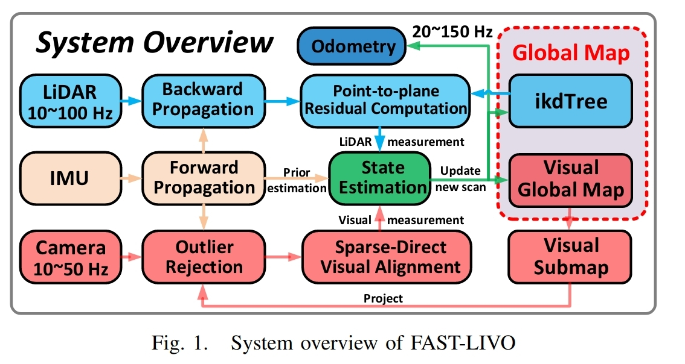
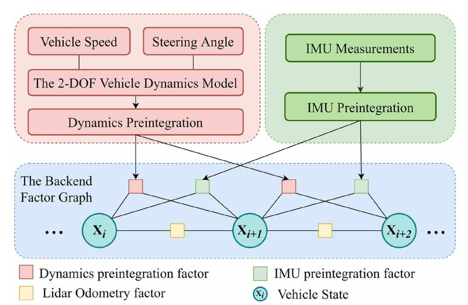

# FAST-LIVO: Fast and Tightly-coupled Sparse-DirectLiDAR-Inertial-Visual Odometry

​		Fast-Livo：快速紧耦合稀疏-DirectLiDAR-惯性视觉里程计

​		论文地址：[FAST-LIVO: Fast and Tightly-coupled Sparse-DirectLiDAR-Inertial-Visual Odometry](https://arxiv.org/abs/2203.00893)
​		多传感器融合可以实现准确和鲁棒的位姿估计，在机器人应用中具有很大的潜力。本文提出了FAST-LVIO：一种融合LiDAR-IMU-视觉的里程计系统，它由两个紧耦合的子系统构成：VIO子系统和LIO子系统。LIO子系统将当前帧扫描到的原始点（而不是特征点，例如边或平面）添加到增量点云地图。点云地图点还附加有图像块，这些图像块会在VIO子系统中使用，通过最小化光度误差来对齐新图像，而无需提取任何视觉特征（例如，ORB或FAST角点特征）。为了进一步提高VIO的鲁棒性和准确性，本文提出了一种孤立点剔除方法来剔除图像中的位于边缘或被遮挡的不稳定点。分别在开放数据集和自己的设备数据上进行了实验。结果表明，本文提出的系统性能优于其他同类系统，并且能够以较低的计算量应对具有挑战性的环境。该系统支持传统旋转激光雷达和固态激光雷达，并且可以在Intel和ARM处理器上实时运行。我们将在Github上将这项工作的代码和数据集公开。

开源代码（待上传）：https://github.com/hku-mars/FAST-LIVO

本文的贡献如下：

1、一种紧耦合的LiDAR-inertial-visual里程仪框架，它建立在两个紧耦合的里程计系统之上：LIO子系统和VIO子系统，这两个子系统都不需要提取特征，通过将各自的激光雷达或视觉数据与IMU进行融合来联合估计系统状态。

2、一种直接而有效的VIO子系统，它重用了LIO子系统的点云地图。具体地说，通过最小化光度误差，将地图中的点投影到新一帧图像上来对齐位姿。LIO子系统的点云地图在VIO子系统中的重用避免了视觉特征的提取、三角化，将两个传感器紧耦合在一起。

3、将所提出的系统代码开源，该代码可以在Intel和ARM处理器上实时运行，并且既支持旋转雷达，也支持固态雷达。

4、分别在开放数据集和自己的设备数据上进行了实验。结果表明，我们的系统性能优于其他同类系统，并且能够以较低的计算量工作在传感器退化的环境。

# Efficient and Probabilistic Adaptive Voxel Mapping for Accurate Online3D SLAM

​		用于精确实时3D SLAM的高效概率自适应体素地图

​		论文地址：[Efficient and Probabilistic Adaptive Voxel Mapping for Accurate Online 3D SLAM.]()

​		本文提出了一种高效的概率自适应体素地图的方法，考虑了激光点的测量误差和状态估计造成的激光点的不确定性，对地图中平面的不确定性进行建模，提出了一种精确的点、面不确定性模型。本文分析了从粗到精的体素地图的需求，然后使用一种由哈希表和八叉树组成的新型体素来高效地构建和更新地图。将体素地图应用于迭代卡尔曼滤波，构造姿态估计的最大后验概率问题。在开放的KITTI数据集上的实验表明，与其他最先进的方法相比，该方法具有很高的准确率和效率。在非重复扫描激光雷达的非结构化环境下的室外实验进一步验证了该映射方法对不同环境和激光雷达扫描模式的适应性。

**本文的贡献如下：**

1、针对激光雷达点云的稀疏性和不规则性，提出了一种大小自适应、由粗到精的体素构建方法。自适应体素图被组织在八叉树-哈希表的数据结构中，以提高体素构建、更新和查询的效率。

2、本文提出了一种精确的概率体素地图表示法，准确地考虑了点测量和激光雷达位置估计引起的点不确定性，以对地图中平面的不确定性进行建模。

3、实现了所提出的系统在真实世界中的激光测距和测绘的应用，并与最新的方法进行了比较。

# SRVIO: Super Robust Visual Inertial Odometry for dynamic environments and challenging Loop-closure conditions

​		SRVIO：适用于动态环境和挑战性回环的超强鲁棒性视觉惯性里程计

​		视觉定位或里程测量问题是自主机器人和汽车领域的一个众所周知的挑战。传统上，这个问题可以通过昂贵的传感器（如：激光雷达）来解决。目前，最主要的研究方案是使用廉价的传感器（如摄像机和IMU）进行定位。基于几何方法的定位方法在光照稳定，没有动态物体的情况下表现的很好，然而这些方法在这种具有挑战性的环境中不够鲁棒。科学家们开始使用深度神经网络(DNN)来解决这个问题。使用DNN背后的主要思想是更好地理解数据内部的问题，并克服复杂的条件(如相机前的动态对象、极端照明条件、高速运动等)。现有的端到端DNN方法能够克服上述一些挑战。然而，目前没有一个通用和鲁棒的框架可以适用于所有这些场景。在本文中，我们结合了几何方法和DNN方法，以获得几何SLAM的优点，并在DNN的帮助下克服剩余的挑战。为此，我们修改了VINS-Mono框架(到目前为止最鲁棒和最准确的框架)，与基于几何和端到端DNN的SLAMS相比，我们能够在TUM-Dynamic、TUM-VI、ADVIO和EURC数据集上获得最优秀的结果。

​		本文针对现有VIO方法的不足，提出了一种基于深度学习的VIO框架。在该框架中，设计了一个融合视觉的预处理步骤来实时克服动态对象问题，该模型的优化部分能够在不同的数据源(包括视觉、惯性)之间切换以保持稳定，并在任何情况下提供准确的估计。我们模型中融合惯性预处理部分解决了积分输出发散的问题，同时提供实时输出。最后，我们提出了一种闭环机制，用于在白天、夜间场景中进行鲁棒定位。针对所有最先进的方法，使用常见的场景及具有挑战性的场景，对本文提出的框架进行评估，结果表明本文提出的系统效率高。

# LiDAR-Inertial 3D SLAM with Plane Constraint forMulti-story Building

​		带有平面约束的多层建筑的激光雷达-惯性SLAM，英文名字是LiDAR-Inertial 3D SLAM with Plane Constraint for Multi-story Building，随处可见的平面和结构的一致性是室内多层建筑与室外环境相比最明显的特点。本文针对多层建筑提出了一种具有平面特征的紧耦合激光雷达-惯性的SLAM系统。本文提出的系统主要由三部分组成：激光雷达-惯性里程仪、结构代表性平面提取和因子图优化。通过建立局部地图和惯性测量单元(IMU)的预积分，我们分别获得了LiDAR帧到局部地图的匹配和IMU的测量。最小化联合代价函数，得到LiDAR-惯性里程计信息。一旦将新的关键帧添加到图中，就会提取该关键帧中能够表示结构特征的所有平面，以找到位姿之间的约束。基于关键帧的因子图是在平面约束下进行的，关键帧的LiDAR-惯性里程计实现了精细化。实验结果表明，与目前最先进的算法相比，我们的算法在准确率上具有突出的性能。

本文贡献如下：

1、我们提出了寻找和构造SRP全局约束的方法，以实现在闭环不可能的情况下机器人6自由度状态的精确估计。

2、我们提出了一个紧耦合的激光雷达-惯性slam系统来获得稠密的多层地面的三维点云图。

3、我们使用安装在四足机器人上的Velodyne VLP-16和Xsens MTI-300收集的数据来验证算法的有效性。与其他先进的算法相比，得到了更好的结果。

​		本文的算法由LiDAR-IMU、SRP约束和图优化三部分组成，如图所示。先对IMU数据进行预积分，并对点云的运动畸变进行校正。通过从点云中提取特征点，找出激光雷达的相对测量值。对预积分和LiDAR测量构成的残差进行优化，得到位姿；SRP约束从每个关键帧的点云中提取SRP，并与全局SRP匹配形成因子图中顶点之间的边；图优化在每次形成新的SRP约束时进行优化，并调整关键帧的姿态。

# LIO-Vehicle: A Tightly-Coupled V ehicle Dynamics Extension of  LiDAR Inertial Odometry

​		LIO-Vehicle：一种紧耦合车辆动力学的激光雷达惯性里程计。 

​		我们提出了LIO-Vehicle，这是一种基于车辆动力学的紧耦合的激光雷达惯性里程计（LIO）方法，它提供了高精度、鲁棒性和实时的车辆轨迹估计。由于大多数现有的基于激光雷达的定位方法不是专门针对车辆提出的，因此它们没有考虑地面机器人的运动约束。而且，它们可能在无结构区域（如隧道和狭窄走廊）效果不佳。对于LIO而言，在这些激光雷达退化的情况下，由于没有外部的校正导致累积误差，单靠惯性传感器无法维持可靠的长期精度。因此，有必要引入其他低成本传感器与车辆运动约束，以构建更准确、更鲁棒的里程计算法。在本文中，我们使用车轮速度计和转向角传感器测量建立了一个两自由度车辆动力学模型，然后根据模型的输出构造一个预积分因子。在后端，我们将车辆动力学预积分结果、IMU预积分测量结果和激光雷达里程计结果添加到因子图中，并借助滑动窗口优化得到优化结果。实验表明，与现有的激光雷达惯性里程计方法相比，该方法可以获得更高的定位精度，并且在环境特征不足以进行激光雷达里程计测量的地区，该方法可以显著减小定位误差。 

本文的贡献如下：

 1、为了实现精确、实时和鲁棒的姿态估计与建图，提出了一种激光雷达惯性里程计的紧耦合车辆动力学模型。 

2、采用二自由度车辆动力学模型，通过测量车轮速度计和转向角传感器，获得车辆的线性和角速度。然后根据关键帧构造车辆动力学预积分因子。

 3、在线优化轮速比例因子和转向比比例因子，以适应不同的车辆和路况。

# Robust Real-time LiDAR-inertial Initialization

​		鲁棒的实时激光雷达惯性初始化

​		对于大多数LiDAR惯性里程计，准确的初始状态，包括时间偏差和LiDAR与六轴IMU之间的外部转换，起着重要的作用。然而，在定制的激光雷达惯性系统中，这些信息并不总是可用的。本文提出了一种完全实时的激光雷达惯性系统初始化过程，该过程通过将激光雷达测量得到的状态与IMU测量的状态对齐来校准激光雷达和IMU之间的时间偏移量和外参数，以及重力矢量和IMU偏移量。我们将提出的方法实现为一个初始化模块，如果启用该模块，它将自动检测采集数据的激励程度，并动态校准时间偏移量、外部偏移量、重力矢量和IMU偏移量，然后将其用作实时LiDAR惯性里程计系统的高质量初始状态值。对不同类型的激光雷达和激光雷达-惯性组合进行的实验表明，该初始化方法具有较好的鲁棒性、适应性和有效性。我们的LiDAR惯性初始化程序Li-Init和测试数据的实现在Github上是开源的，并且也集成到了最先进的LiDAR惯性里程计系统FAST-LIO2中。

开源地址（代码未上传）：https://github.com/hku-mars/LiDAR_IMU_Init

本文的贡献：

1、一种由Fast - lio2改进的鲁棒激光雷达里程计(Fast LO)。

2、在没有任何硬件设置的情况下，激光雷达和IMU之间快速和鲁棒的时间偏移和外部参数校准。

3、支持多种激光雷达类型:机械旋转激光雷达(Hesai, Velodyne, Ouster)和固态激光雷达(Livox Avia/Mid360)

4、作为一个鲁棒的初始化模块合并到FAST-LIO2中。

# Lvio-Fusion: A Self-adaptive Multi-sensor Fusion SLAM Framework

​		论文地址：https://arxiv.org/abs/2106.06783

​		基于传感器的状态估计是移动机器人的关键技术。由于传感器在不同环境中的性能不同，如何对不同传感器的测量值进行融合是一个难题。本文提出了一种基于图优化的紧耦合多传感器融合框架Lvio-Fusion，该框架融合了双目相机、激光雷达、IMU和GPS，特别是针对城市交通场景，引入了一种结合GPS和环路闭合的分段全局位姿图优化方法，可以消除累积漂移。此外，我们创新性地使用了强化学习中的参与者-批评者方法来自适应地调整传感器的权重。经过训练，参与者-批评者能够提供更好的系统和动态的传感器权重。我们在公共数据集上对该系统的性能进行了评估，并将其与其他最新方法进行了比较，结果表明该方法具有较高的估计精度和对各种环境的鲁棒性。

本文贡献如下：
1、基于优化的双目相机、激光雷达、IMU和GPS的紧密耦合的多传感器融合框架，实现了高精度、实时的移动机器人状态估计。
2、一种城市交通场景的分段全局优化方法，可以消除累积漂移，并提供全局定位。
3、提出了一种自适应算法，能够根据不同的环境自适应地调整传感器的权值。

# Radar SLAM: A Robust SLAM System for All Weather Conditions

​		一种适用于各种天气条件的鲁棒SLAM系统

​		论文地址：https://arxiv.org/abs/2104.05347

​		同时定位与建图(SLAM)系统必须是鲁棒的，以支持移动车辆和机器人的长期应用。然而，基于相机和激光雷达的SLAM系统在面临光照或天气条件的挑战时可能会很脆弱，这些条件会降低它们的图像和点云数据。雷达的工作电磁频谱受环境变化的影响较小，尽管其独特的几何和噪声特性在用于SLAM时带来了挑战，但前景很被人看好。本文研究了调频连续波雷达在大规模室外环境中的应用。我们提出了一个完整的雷达SLAM系统，其中包括一种利用雷达几何结构进行可靠特征跟踪的新的雷达运动跟踪算法。它还通过联合优化来最优地补偿运动失真和估计位姿。它的回环被设计成通过捕获和利用周围环境的结构信息来对雷达图像进行简单而高效的处理。从城市街道和居民区到农村和高速公路的三个公共雷达数据集的广泛实验表明，与最先进的激光雷达、视觉和雷达方法相比，所提出的雷达SLAM系统的准确性和可靠性性能具有竞争力。结果表明，在大雪、浓雾等极端天气条件下，该系统在技术上是可行的，显示了雷达用于全天候定位和测绘的良好潜力。
本文贡献如下：
1、一种鲁棒的数据关联和孤立点抑制机制，利用雷达几何进行基于雷达的特征跟踪。
2、提出了一种新的运动补偿模型，以减少低扫描速率引起的运动失真。在优化框架下，运动补偿与位姿估计联合优化。
3、设计了一种快速有效的回环检测的方案。
4、在三个可用的公共雷达数据集上进行了广泛的实验，演示并验证了SLAM系统在极端天气条件下运行的可行性。
5、独特的鲁棒性和最小的参数调整，即所提出的雷达SLAM系统是唯一可以在所有数据序列上正常工作的方法，特别是使用相同的参数，不需要太多的参数调整。

# CLINS: Continuous-Time Trajectory Estimation for LiDAR-Inertial System

​		CLINS: 基于激光-惯性系统的连续时间轨迹估计

​		论文地址：https://arxiv.org/pdf/2109.04687.pdf

​		开源代码：https://github.com/APRIL-ZJU/clins

​		在这篇文章中，我们提出了一个用于SLAM的准确度极高的连续时间轨迹估计框架。它能够高效地融合高频率与不同步的传感器信息。我们在一个3D激光-惯性系统下使用了这一套框架来验证其效果。本文提出的方法使用了非刚体配准的方法来进行连续时间的轨迹预测，同时来进行激光雷达的点云畸变矫正。除此之外，当回环检测发生时，我们还提出了一个两阶段的轨迹矫正方法，来高效的解决比较耗时的全局优化问题。我们在几个公开的数据集以及我们自己采集的数据上都测试了我们的方法。实验的结果表明了当激烈的运动发生时，我们的方法优于离散时间估计的方法。此外，我们还开源了代码以给研究社区做出贡献。
本文主要贡献：

1. 提出了一个连续时间的轨迹估计器，支持融合3D激光雷达的数据与IMU的数据，并且很容易将其扩展，使得其能够融合其他不同频率的传感器信息。
2. 提出了一个两阶段的轨迹矫正方法来有效的解决回环检测时的计算量问题。
3. 所提出的方法在几个公开的数据集以及我们采集的数据集上进行了验证，并且跟其他SOTA的方法进行比较。我们还开源了代码。据我们所知，这是第一份开源的连续时间的激光-惯性轨迹估计器的工作。

# Direct LiDAR Odometry: Fast Localization With Dense Point Clouds

​		Direct激光雷达里程计：稠密点云的快速定位。   

​		开源代码：https://github.com/vectr-ucla/direct_lidar_odometry

​		在具有感知挑战性的环境中，野外机器人需要快速准确的状态估计，为此，本文提出了一种轻量的前端激光雷达里程计解决方案，该解决方案能够为计算受限的机器人平台提供一致且准确的定位。我们的直接激光雷达里程计（DLO）方法包括几个关键的算法创新，它们优先考虑计算效率，并允许使用稠密、预处理最少的点云实时提供准确的姿态估计。这是通过一个新的关键帧系统实现的，该系统有效地管理历史地图信息，此外还有一个自定义的迭代最近点求解器，用于快速点云注册和回收。与目前最先进的技术相比，我们的方法更精确，计算成本更低，并且作为NASA JPL团队合作者针对DARPA地下挑战的研究和开发工作的一部分，已经在空中和腿部机器人的多种感知挑战环境中进行了广泛评估。   在本文中，我们介绍了我们的激光雷达里程计（DLO）算法，这是一种高效的前端定位解决方案，直接使用稠密点云帧，而无需进行大量预处理。这项工作的主要贡献是一个速度优先通道，它使用最小化预处理的激光雷达点云帧和IMU，实时准确地解算机器人的姿态。我们工作的一个关键点是建立算法速度和准确性之间的联系，我们的方法由三个核心创新组成。首先，一个自适应关键帧系统通过一个新的空间度量有效地捕获重要的环境信息。其次，提出了一种基于关键帧的快速构建方法，该方法通过凸优化生成允许的局部子地图，用于全局姿态优化。第三，NanoGICP，一个定制的迭代点解求解器，以消除冗余计算。作为CoSTAR团队针对DARPA地下挑战项目的研发工作的一部分，我们的方法在计算受限的机器人平台上的众多挑战性环境中得到了广泛的评估，我们已经开放了我们的代码。 

# A General Framework for Lifelong Localization and Mapping in Changing Environment

​		在多变环境中长期定位和建图的通用框架 

​		论文地址：[[2111.10946\] A General Framework for Lifelong Loca...](https://arxiv.org/abs/2111.10946)   

​		大多数现实世界中的场景，如商场和超市，环境总是在变化的。没有考虑到这些变化的先验地图很容易失效。因此，有必要建立最新的环境地图，以便于机器人的长期运行。为此，本文提出了一种通用的lifelong  SLAM框架，该框架使用多地图表示，并提出了一种高效的地图更新策略，包括地图构建、位子图图细化和稀疏化。为了缓解内存使用量的无限增长，我们提出了一种基于Chow-Liu最大互信息生成树的映射裁剪方法。所提出的SLAM框架已经在真实的超市环境中通过一个多月的机器人部署得到了全面的验证。此外，我们还发布了从室内和室外变化环境中收集的数据集，我们的数据集在[GitHub - sanduan168/lifelong-SLAM-dataset](https://github.com/sanduan168/lifelong-SLAM-dataset)上可用 

本文贡献如下： 

1、一个完整的lifelong SLAM通用框架，在不断变化的环境中有效地运行 

2、一种基于子图的图稀疏方法，以恒定的计算和存储复杂度实现高精度。

3、开源LIDAR、IMU和编码器在不断变化的环境中的数据的公共数据集，用于lifelong SLAM